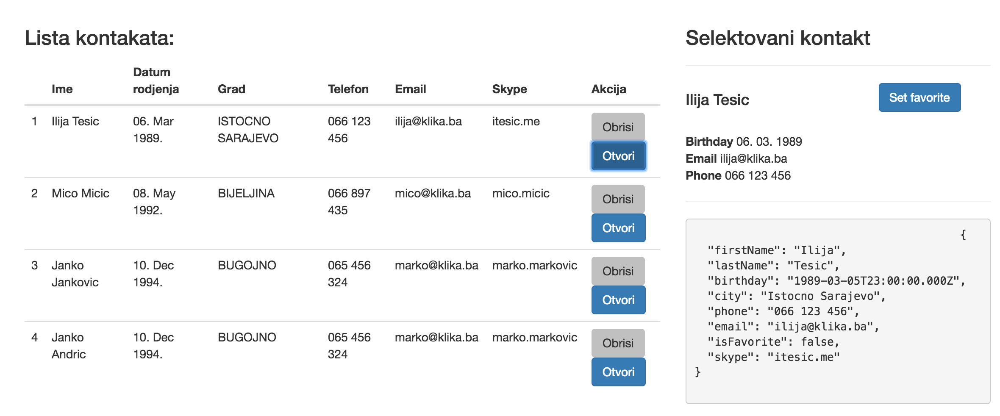

## Zadatak 4.

Contact objekat treba da sadrži sledeće podatke:

``` javascript
{
    firstName: '',
    lastName: '',
    birthday: new Date(),
    city: '',
    phone: '',
    email: '',
    skype: '',
    isFavorite: false
}
```

Napraviti servis `ContactService` u modulu `contact` koji ce da čuva trenutno selektovani kontakt iz liste.
`PhonebookCtrl` poziva metodu `selectContact()` iz `ContactService` i čuva selektovani kontakt u tom servisu. `ContactCtrl` čita selektovani kontakt iz tog servisa i prikazuje ga.

`ContactService` treba da ima metodu `fullName()` koja ce da vraća Ime i Prezime odvojeno razmakom.
`ContactService` treba da ima metodu `toggleFavorite()` koja će naizmjenično da mijenja flag `isFavorite` na kontaktu (ako je `false` postavi `true` i obrnuto). Dodati u UI opciju za postavljanje nekog kontakta kao favorite.


